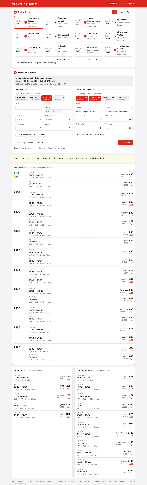

# Man Utd Trip Planner

A small personal web app for planning flights to Manchester United games.

1. **Pick a fixture.** Every upcoming Man Utd Premier League game is listed, with home/away filters. You can also plan a custom trip for cup or European games.
2. **Pick your days.** Tick one or more days to fly out (up to 3 days before) and back (up to 3 days after).
3. **Get the best flights.** You see the cheapest outbound + return combinations, plus every option for each direction, with prices.



## Features

- **Your airports, in your order.** Under ⚙ My airports, keep two ranked lists: airports you fly from, and airports you fly into for Old Trafford. Reorder them with ↑ ↓ and remove with ✕. To add one, search by airport name, city or country ("Knock", "Belfast", "Ireland") and pick it from the list. Codes like DUB still work. They're saved on the device and used for every search. On any single trip, tap an airport to leave it out, or add one just for that trip.
- **Sort by your airports or by price.** "My airport order" lists your favourite airports first, then cheapest. "Cheapest" ignores airport order. In airport order, a tip tells you when a lower-ranked airport would save money, and by how much.
- **Same airport or not.** By default the return flies from the airport you flew into, back to the airport you left from. Untick either box to fly home from somewhere else (for example, into MAN and out of LPL) or to land at a different home airport.
- **Away games.** Each away ground suggests its nearest airports (Newcastle → NCL, Chelsea → LHR/LGW/LCY, …). Click the chips to add or remove them.
- **Time windows.** Each direction has depart after/before and arrive after/by.
  - *Land in time for kick-off* fills in a matchday flight that lands a set number of hours before kick-off.
  - *Leave after full time* fills in a matchday return that departs a set number of hours after kick-off.

  You can change both gaps in settings.
- **Direct only** filter and GBP/EUR/USD prices.
- A **View** link on every flight opens Google Flights so you can book.

## Put it online (phone + PC, nothing to install)

The app is set up for [Vercel](https://vercel.com)'s free plan. You do all of this in a web browser, once:

1. **Get a flight-price key.** Sign up for the free plan at [SerpApi](https://serpapi.com/users/sign_up) and copy your **API key** from the dashboard.
2. **Sign up to Vercel** at [vercel.com/signup](https://vercel.com/signup) and choose **Continue with GitHub** (Hobby plan, free).
3. Click **Add New… → Project** and **Import** `Manchester-Trip-Planner`. If it isn't listed, click *Adjust GitHub App Permissions* and give Vercel access to the repo.
4. On the configure screen, leave everything as it is, but open **Environment Variables** and add two variables:
   - `SERPAPI_KEY`: your SerpApi key.
   - `APP_PIN`: any PIN you like. Each device asks for it once, so strangers who find your link can't use up your searches.
5. Click **Deploy**. About a minute later you get a link like `https://manchester-trip-planner.vercel.app`.
6. **On your phone**, open the link and add it to your home screen so it opens like an app:
   - iPhone: Safari → Share → *Add to Home Screen*.
   - Android: Chrome → ⋮ → *Add to Home screen*.

Any change pushed to the repo goes live automatically.
If you change an environment variable later, apply it in Vercel with **Deployments → ⋯ → Redeploy**.

Your saved airports are remembered per device, so set them once on your phone and once on your PC.

### Prices and search usage

Live prices come from Google Flights through [SerpApi](https://serpapi.com/google-flights-api).
Without `SERPAPI_KEY` the app runs in **demo mode** with made-up prices, shown by the "Demo prices" badge.

Each day you select uses one search per direction. Repeat searches are cached for a while, which saves your quota.

### Running it on your own computer instead (optional)

Needs Node.js 18+, with no `npm install`:

```bash
cp .env.example .env     # add SERPAPI_KEY (and optionally APP_PIN)
npm start                # → http://localhost:3000
```

### Fixtures

Fixtures come from the free [openfootball](https://github.com/openfootball/football.json) dataset, with no key needed.
Kick-off times are UK time and can move for TV, so double-check before booking.
Only Premier League games are included. Use **custom trip** for cup and European games.

## Notes

- Each direction is priced as a one-way fare. That's what makes mixing airports work, and it's how Ryanair/easyJet/Aer Lingus price these routes anyway.
- A trip is only shown if the return leaves at least 2 hours after the outbound lands.
- To change a ground's airports, edit `lib/grounds.js`.
- The airport search list comes from [OurAirports](https://ourairports.com/data/) (public domain). `scripts/update-airports.py` rebuilds it.

## Development

```bash
npm test
```
